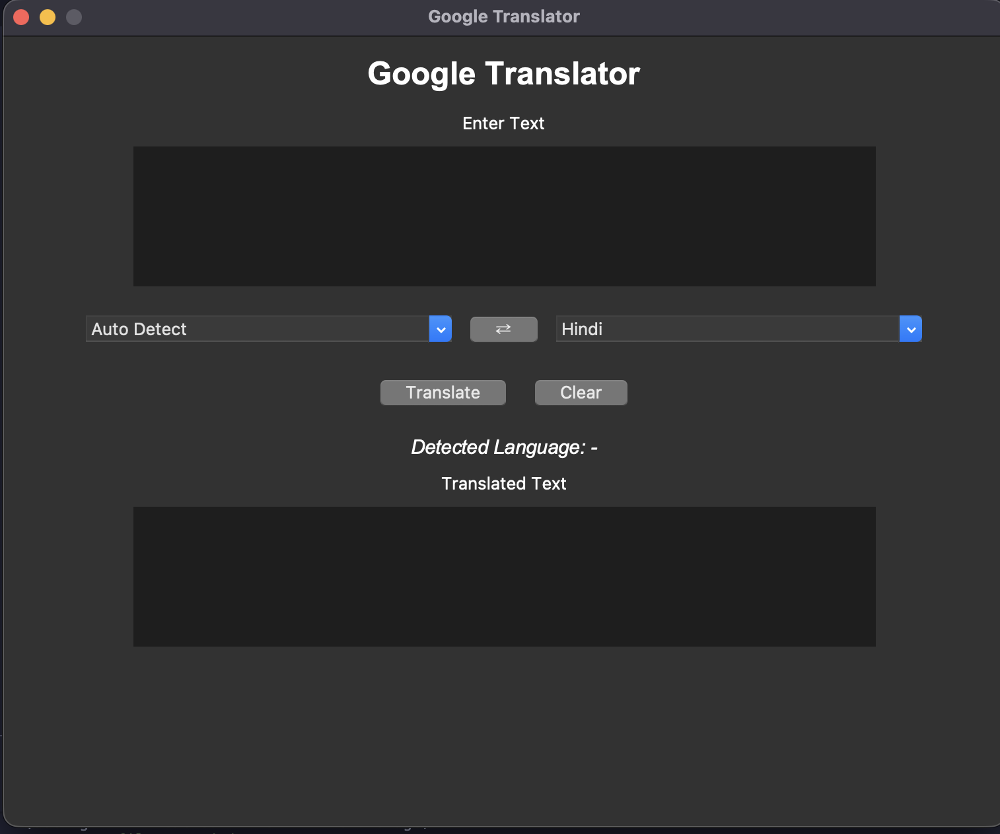
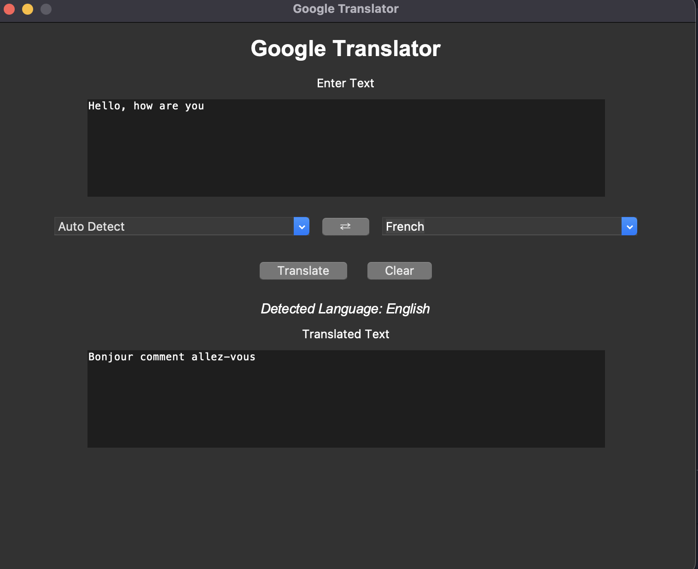

# 🌍 Google Translator Desktop App

A modern desktop application built with **Python**, **Tkinter**, and the **Google Translate API (`googletrans`)** that allows users to translate text between **100+ languages** with automatic language detection.

---

## ✨ Features

- 🌐 Translate text between 100+ languages
- 🔍 Automatic language detection
- 🔄 Swap source and destination languages
- 🧹 Clear input and output with one click
- 🖥️ Simple and responsive desktop GUI
- ⚡ Built using asynchronous programming (`asyncio`)
- 📦 Modular project architecture
- 🛠️ Easy to extend with additional features

---

## 📷 Screenshots

### Home Screen



### Translation Example



---

# 📂 Project Structure

```text
translator/
│
├── main.py
│
├── services/
│   └── translator_service.py
│
├── ui/
│   ├── app.py
│   └── callbacks.py
│
├── utils/
│   └── languages.py
│
├── assets/
│   ├── home.png
│   └── translation.png
│
├── pyproject.toml
├── uv.lock
└── README.md
```

---

# 🏗️ Architecture

The project follows a modular architecture where each module has a single responsibility.

| Module | Responsibility |
|---------|----------------|
| `main.py` | Application entry point |
| `ui/` | Tkinter interface and event callbacks |
| `services/` | Google Translate service |
| `utils/` | Language mappings and shared utilities |

---

# 🛠️ Technologies Used

- Python 3.13 (tested)
- Tkinter
- asyncio
- googletrans 4.x (Async API)
- uv (Python package manager)

---

# 📋 Requirements

- Python 3.13
- Internet connection
- Tkinter
- googletrans

---

# 🚀 Installation

## Clone the Repository

```bash
git clone https://github.com/RaushanBhanu/Translator

cd google-translator
```

---

## Create a Virtual Environment

Using **uv**

```bash
uv venv
```

Activate it.

### macOS / Linux

```bash
source .venv/bin/activate
```

### Windows

```powershell
.venv\Scripts\activate
```

---

## Install Dependencies

```bash
uv sync
```

or

```bash
uv add googletrans
```

---

## Run the Application

```bash
uv run python main.py
```

---

# ⚙️ How It Works

The application follows a simple workflow.

```text
User
  │
  ▼
Tkinter GUI
  │
  ▼
Callbacks
  │
  ▼
Translation Service
  │
  ▼
Google Translate API
```

---

# 🔄 Translation Flow

```text
User enters text
        │
        ▼
Select Source & Destination Language
        │
        ▼
Translation Service
        │
        ▼
Google Translate API
        │
        ▼
Display Translated Text
```

---

# 🔍 Auto Detect

When **Auto Detect** is selected, the application does **not** specify the source language.

```python
await translator.translate(
    text,
    dest=destination,
)
```

Google Translate automatically detects the language and returns it in:

```python
result.src
```

The detected language is displayed in the GUI.

### Example

| Item | Value |
|------|-------|
| **Source Language** | Auto Detect |
| **Destination Language** | English |
| **Input** | `Bonjour` |
| **Detected Language** | `French` |
| **Output** | `Hello` |

---

# ⚡ Asynchronous Translation

The latest version of **googletrans** provides an asynchronous API.

Instead of

```python
translator.translate(...)
```

the application uses

```python
await translator.translate(...)
```

This allows translation requests to be performed asynchronously while keeping the application's architecture modern and scalable.

---

# 🌎 Supported Languages

The application supports every language available in

```python
googletrans.LANGUAGES
```

Some examples include:

- English
- Hindi
- Japanese
- Korean
- Chinese
- French
- German
- Spanish
- Russian

...and many more.

---

# ✨ Features Explained

## 🌐 Translate

Translates the entered text into the selected destination language.

---

## 🔍 Auto Detect

Automatically detects the source language before translation.

---

## 🔄 Swap Languages

Swaps:

- Source language
- Destination language
- Input text
- Output text

making reverse translation quick and convenient.

---

## 🧹 Clear

Clears:

- Input text
- Output text
- Detected language label

---

# ⚠️ Error Handling

The application gracefully handles:

- Empty input
- Missing destination language
- Translation failures
- Network-related errors
- Invalid requests

using Tkinter message boxes.

---

# 📚 Learning Outcomes

This project demonstrates:

- Tkinter GUI development
- Async programming with `asyncio`
- API integration
- Modular Python architecture
- Event-driven programming
- Error handling
- Python dependency management using `uv`

---

# 🤝 Contributing

Contributions are welcome!

1. Fork the repository.

2. Create a feature branch.

```bash
git checkout -b feature-name
```

3. Commit your changes.

```bash
git commit -m "Add new feature"
```

4. Push your branch.

```bash
git push origin feature-name
```

5. Open a Pull Request.

---

# 📄 License

This project is licensed under the MIT License.

---

# 👨‍💻 Author

**Raushan Bhanu**

- GitHub: https://github.com/RaushanBhanu
- LinkedIn: https://linkedin.com/in/raushan-bhanu

---

⭐ If you found this project helpful, consider giving it a star on GitHub!
